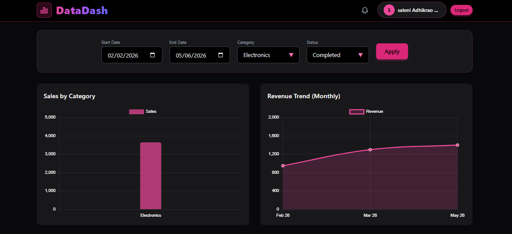
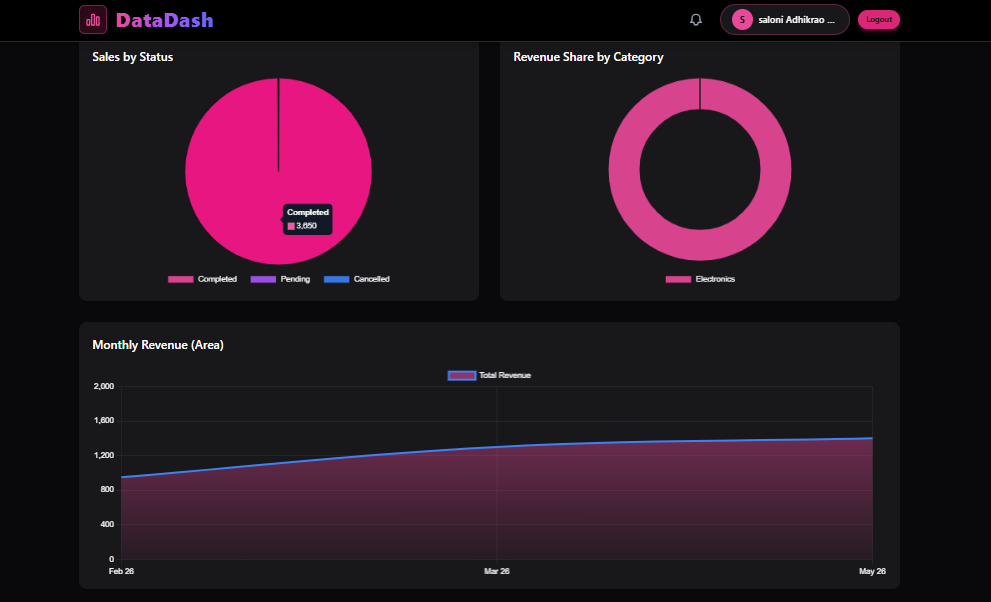

# 📊 DataDash – Sales Analytics Dashboard

## 🚀 Project Overview

**DataDash** is a responsive Sales Analytics Dashboard built using React.js.  
It visualizes sales data using interactive charts and allows users to dynamically filter data by:

- 📅 Date Range  
- 🏷 Category  
- 📌 Status  

All charts update automatically when filters are applied.  
This project demonstrates frontend dashboard development and dynamic data visualization.

---

## 🛠 Tech Stack Used

### 🔹 Frontend
- React.js  
- Tailwind CSS  
- Chart.js  
- React-Chartjs-2  
- Axios  

### 🔹 Backend
- Node.js  
- Express.js  

### 🔹 Database
- MongoDB (MongoDB Atlas)  
- Mongoose  

---

> Example filter:  
> `GET /api/sales/filter?category=Electronics&status=completed&startDate=2026-01-01&endDate=2026-02-01`

---

## 📊 Dashboard Features

- 📊 Bar Chart – Sales by Category  
- 📈 Line Chart – Sales Trend Over Time  
- 🥧 Pie Chart – Category Distribution  
- 🍩 Doughnut Chart – Sales Status Distribution  
- 📉 Area Chart – Revenue Growth  
- 🔍 Dynamic Filtering System  
- 📱 Fully Responsive UI  

---

## 🗄 Database Schema

### Sale Model

```js
const mongoose = require("mongoose");

const saleSchema = new mongoose.Schema({
  product: { type: String, required: true },
  category: { type: String, required: true },
  amount: { type: Number, required: true },
  status: { type: String, enum: ["completed", "pending", "cancelled"], required: true },
  date: { type: Date, default: Date.now },
});

module.exports = mongoose.model("Sale", saleSchema);
```

---

### Backend Setup

```bash
cd backend
npm install
npm start
```

## 📝 Environment Variables (.env)

Create a `.env` file in the **backend** folder with the following variables:

```env
# MongoDB connection string
MONGO_URI=your_mongodb_connection_string_here

# Backend server port
PORT=5000

# JWT secret key
JWT_SECRET=your_jwt_secret_here
```

---


## 💻 Frontend Setup

```bash
cd frontend
npm install
npm run dev
```

---

## 📸 Dashboard Screenshots



